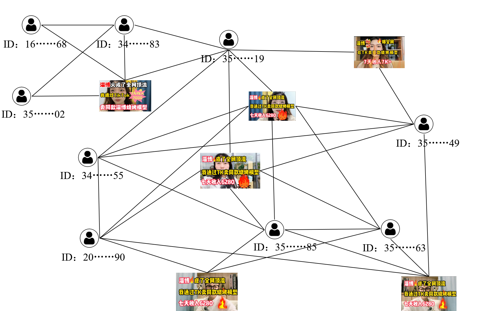

## 🔍 1. Overview
This repository contains the implementation of a novel community search framework based on the τ-ρ-camp model.
- We propose τ-ρ-camp as a community model that captures both direct and indirect interaction patterns by leveraging triangles and quadrangles—key building blocks of convex cycles in graphs.
- By restricting the counts of these local structures on edges, the model flexibly represents network semantics at different granularities.
Using this model, we define the support-maximized community search problem, which aims to identify communities with the densest semantic structures.
- We further develop an efficient approximation algorithm that exploits the hierarchical nature of the τ-ρ-camp index, solving the problem in linear time with a guaranteed approximation ratio of 2.
---

## ⚙️ 2. Build Instructions (C++)

### Requirements
- C++17 compiler (e.g., GCC ≥ 10.3.0)

- CMake ≥ 3.28

### build

```bash
mkdir build
cd build
cmake ..
make -j
```
The executable trussquad will be generated in the build directory.
## 🚀 3. Quick Start
### Step 1: Indexing and Querying
We support three modes of execution:
Mode 1: Build Index Only

```bash
./trussquad $datapath $indexfolder $maxuser $maxnode $datatype
```
Mode 2: Query Only
```bash
./trussquad $indexfolder $querypath $queryresult $is_onePoint $maxuser $maxnode $datatype
```
Mode 3: Index + Query (Full Pipeline)
```bash
./trussquad $datapath $indexfolder $querypath $queryresult $is_onePoint $maxuser $maxnode $datatype
```
| Parameter     | Description                                                                                          |
| ------------- | ---------------------------------------------------------------------------------------------------- |
| `datapath`    | Path to the input edge list. Each line contains two node IDs. Nodes are 0-indexed.                   |
| `indexfolder` | Output folder for intermediate files and final `index.txt`.                                          |
| `querypath`   | Query node list. Each line: one node ID (single-node query) or space-separated IDs (multi-node).     |
| `queryresult` |Each line in the output file corresponds to the community ID result of the query on the same line number in the input query file.                 |
| `is_onePoint` | `True` for single-node queries, `False` for multi-node queries.                             |
| `maxuser`     | Maximum ID of the first node type. This value serves as the boundary to distinguish between two types of nodes, since some datasets order content nodes first and others order user nodes first.                                 |
| `maxnode`     | Maximum node ID in the graph. Nodes are numbered from 0 to `maxnode`.                                |
| `datatype`    | Encoding type: `0` if content nodes follow user nodes; `1` if users follow contents; `2` if uniform. |

### Step 2: Evaluating Centrality Metrics
Use our Python script to evaluate centrality-related metrics of result nodes，Requires Python 3.9 or higher:
```bash
python evaluate.py path/to/edge_file.txt path/to/centrality_file.txt path/to/nodes_file.txt
```
Arguments:
- edge_file: Input graph file (same as datapath).

- centrality_file: Output file to save node-level centrality metrics.

- nodes_file: A list of node IDs to evaluate, one per line.

This script computes centrality indicators (e.g.closeness, betweenness) using **python-igraph**.

## 📁 4. Project Structure
```php
.
├── main.cpp                # Main entry point
├── trussquad.cpp / .h      # Core algorithm implementation
├── common.h                # Shared constants and utility definitions
├── evaluate.py             # Python script for centrality evaluation
├── CMakeLists.txt          # Build configuration file
├── README.md               # Project documentation
├── datasets.rar            # Compressed dataset archive containing:
│   ├── bilibili.txt        # Bilibili network edge list
│   ├── dblp.txt            # DBLP co-authorship network
│   ├── weibo.txt           # Weibo social network
│   ├── Youtube.txt         # YouTube user interaction graph
│   └── readme.txt          # Description and notes about datasets

```

## 🧠 5. case study
Below is a visualization of the community detection results of our method on a real-world network（bilibili）:

## 📚 6. Citation
- [ ] TODO
## 📄 7. License
This project is licensed under the Apache License 2.0 - see the [LICENSE](LICENSE) file for details.
